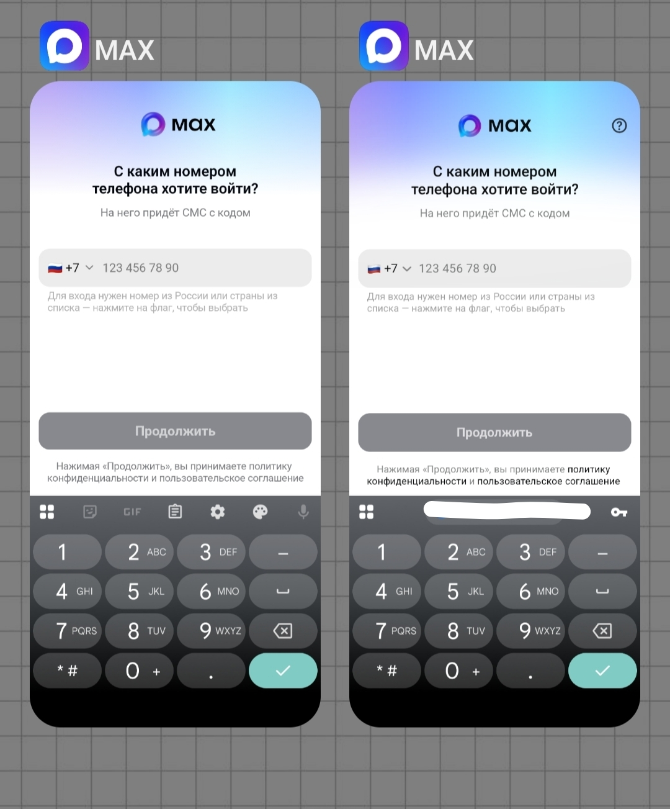
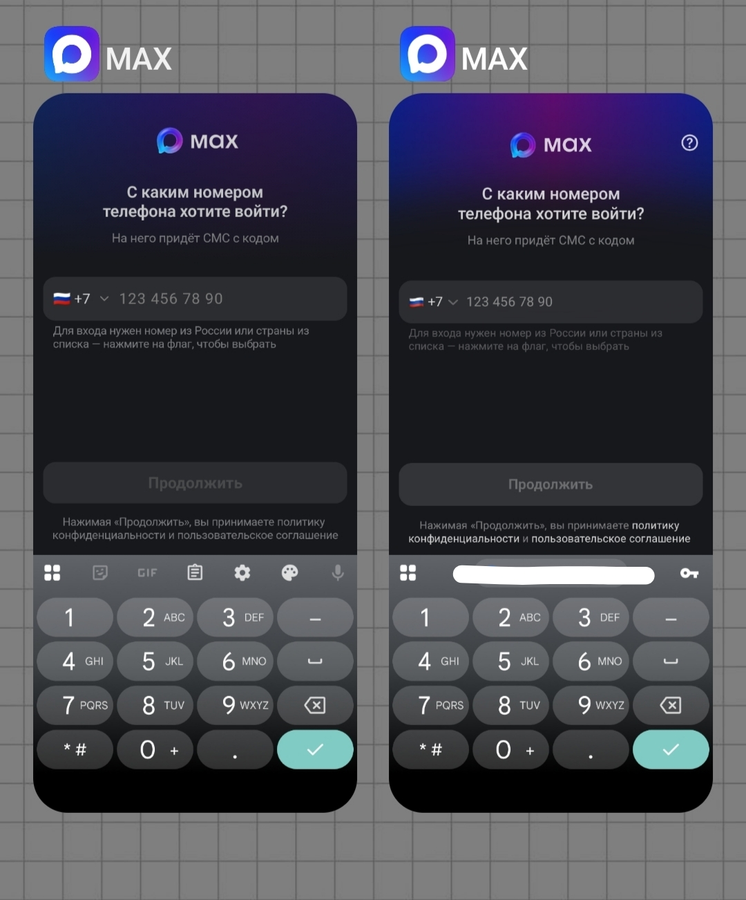
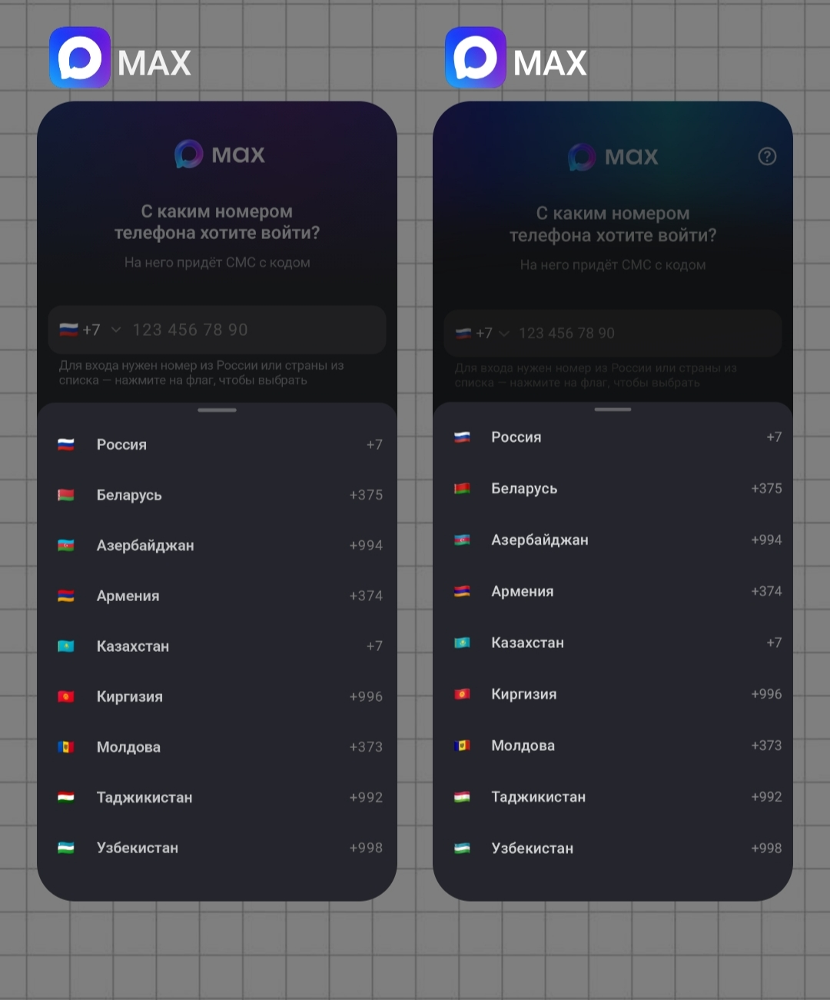
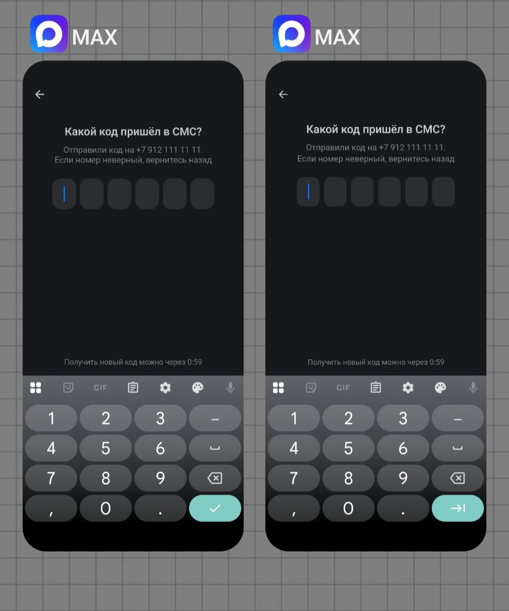

# MAX — мессенджер, который не ловит нигде*

*На парковке тоже не ловит

Это приложение настолько не ловит, что вы даже не сможете зарегистрироваться, ведь код подтверждения никогда не приходит!

## Описание
После ввода номера телефона ничего не происходит. Так и было задумано.
Приложение максимально похоже на оригинальное: натуральный размер (217 MB, близко к размеру оригинального приложения), поддержка светлой и тёмной темы, та же иконка, все элементы интерфейса выглядят схожим образом (см. скриншоты, национальный мессенджер находится справа).
После того, как вы вводите номер телефона, запускается таймер обратного отсчёта. Когда время истекает, вы можете запросить код повторно (и он снова никогда не придёт).

## Скриншоты

<table>
  <tr>
    <td></td>
    <td></td>
  </tr>
  <tr>
    <td></td>
    <td></td>
  </tr>
</table>

## Установка приложения

**Системные требования**:
- Android 8.0 (Oreo) и выше
- Не менее 218 Мбайт свободной памяти

Обратите внимание, что имя пакета `ru.oneme.app`, поэтому установить данное приложение одновременно с оригинальным не получится. 

**Инструкция**:
1. Скачайте файл .apk, перейдя по [ссылке](https://github.com/MirnayaPautina/MAX/releases/download/v1.0/app-release.apk).
2. Откройте файл на своём устройстве.
3. Разрешите установку из неизвестных источников в настройках, если появится предупреждение.
4. Установите приложение (Google Play Protect может предложить просканировать приложение перед установкой).
5. Смело демонстрируйте окружающим неработающий мессенджер. Когда вам порекомендуют переустановку, скажите, что уже пробовали.

## Используемые технологии

- **Kotlin**
- **Jetpack Compose**
- **Jetpack Navigation**
- **MVVM**

## Текущий статус
Проект в разработке. В первой версии приложения код никогда не приходит. Именно эту версию вы можете установить себе прямо сейчас. Во второй планируется всегда высылать вам неправильный код.

## Благодарности
Создателям национального мессенджера, а также авторам следующих цитат:

«Мессенджер сам по себе ничего не ловит, ловит сеть» 
(с) Один российский политик

«Мессенджер сам по себе ничего не ловит, ловит товарищ майор» 
(с) Анонимус
